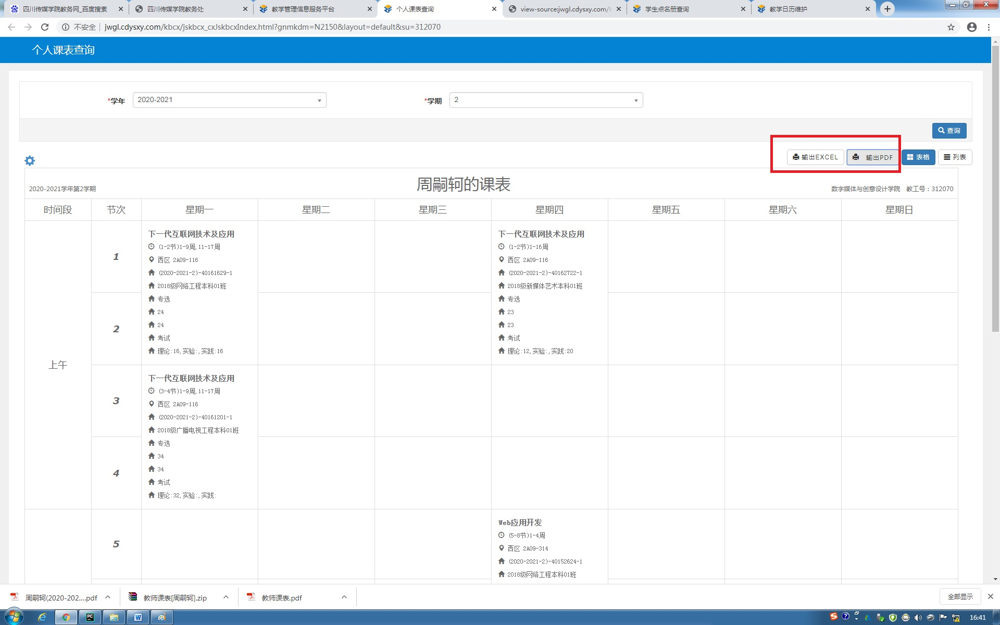
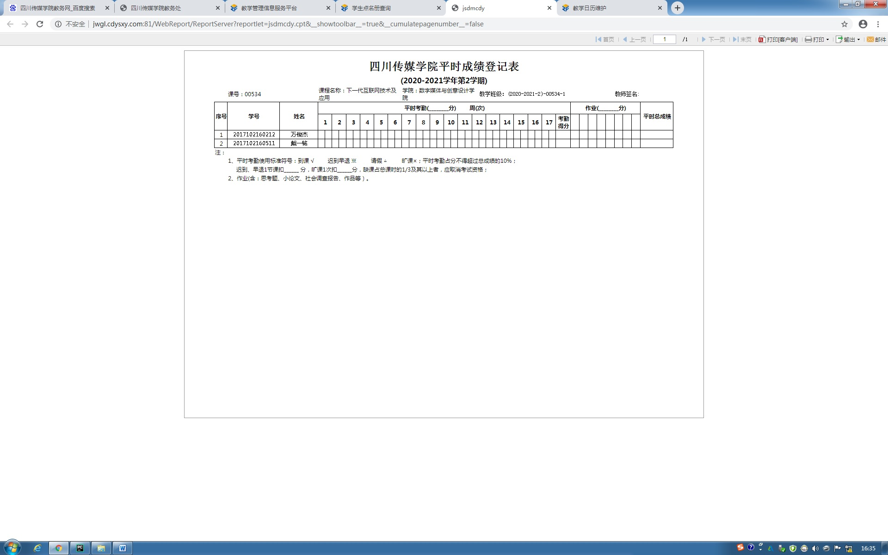

# README

[TOC]

## 相关需求

1. 教师办公自动化系统后台协调。协调各组数据库、界面风格、UI优化

   ==个人登录首页页面样例==

   

2. 添加教师登录（包括cookie、防伪机器人验证码)

3. PDF或Excel文件保存功能接口，成绩打印功能接口

   ==文件保存功能样例==

   

   ==成绩打印样例==

   

   


## Version

#### Python version: 3.8.2

#### Django version: 2.2.11

install method:

```txt
pip3 install Django==2.2.11 -i https://pypi.tuna.tsinghua.edu.cn/simple
```

## TODO

- student opeartion
- search course
- form css


python manage.py makemigrations
python manage.py migrate

## TIPS

#### account

Teahcer:
任猎城
u: 1280000001
p: 12345678
镇天稽
u: 1110000001
p: 22334455
爱嘤诗贝伦
u: 1160000001
p: 12341234
牛有力
u: 2660000001
p: password


Student:
李大爽
u: 2020000001
p: libigshuang

张三
u: 2018000001
p: zhang333


2044000001
three12345

2020000002
xiaored


## Problems

#### 1 如何给Class-Based Views 的as_view()生成的view方法里面传参。

比如UpdateTeacherView和UpdateStudentView里面获取不到view方法传入的其他参数
解决方法： 重写get_context_data()， 在里面先写入固定的参数